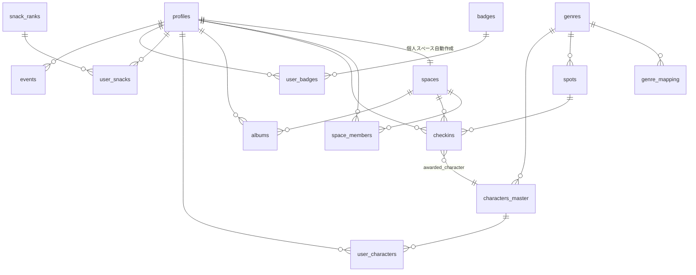

# DB設計書: おでかけ記録×育成アプリ(仮称)

- バージョン: 1.2(ドラフト)
- 作成日: 2026-07-17 / 更新日: 2026-07-18
- 前提: REQUIREMENT.md v1.4 に準拠。Supabase(PostgreSQL 15+ / PostGIS / Auth / Storage / RLS)

---

## 1. 設計方針

1. **ゲームロジックはすべてサーバー側**: 抽選・XP計算・制約判定はPostgreSQL関数(RPC)で実行し、クライアントは結果を受け取るのみ(REQUIREMENT 4章)。ゲーム状態を変えるテーブルへの直接INSERT/UPDATEはRLSで禁止する
2. **数値はマスタテーブル駆動**: 基礎XP・レア度・出現率・進化閾値・おやつ換算値はすべてマスタテーブルで管理し、コード変更なしで調整できる(REQUIREMENT 原則・F-05)
3. **冪等な同期**: オフラインキューからの再送に備え、チェックインはクライアント生成の `client_id` で冪等化する
4. **v2を見据えた形状**: spaces/space_members はMVPでは個人スペース1個だが、複数人参加を前提としたスキーマにしておく(REQUIREMENT F-02)
5. **タイムスタンプはUTC+ローカル日付の二重持ち**: 「1日1回」判定は端末ローカル日付で行う(REQUIREMENT F-03)

---

## 2. ER概要



---

## 3. テーブル定義

### 3.1 ユーザー・スペース

```sql
-- ユーザープロフィール(auth.usersと1:1)
create table public.profiles (
  id                    uuid primary key references auth.users(id) on delete cascade,
  display_name          text,
  home_location         geography(point, 4326),   -- ホームエリア座標
  home_area_updated_at  timestamptz,              -- 90日クールダウン判定用
  created_at            timestamptz not null default now()
);

-- スペース(MVP: 1ユーザー1個の個人スペースを自動生成)
create table public.spaces (
  id          uuid primary key default gen_random_uuid(),
  owner_id    uuid not null references public.profiles(id) on delete cascade,
  name        text not null default 'マイスペース',
  created_at  timestamptz not null default now()
);

-- スペースメンバー(MVPではowner 1名のみ。v2で複数人参加)
create table public.space_members (
  space_id   uuid not null references public.spaces(id) on delete cascade,
  user_id    uuid not null references public.profiles(id) on delete cascade,
  role       text not null default 'owner' check (role in ('owner', 'member')),
  joined_at  timestamptz not null default now(),
  primary key (space_id, user_id)
);
```

サインアップ時のトリガー(`handle_new_user`)で profiles → 個人スペース → space_members を自動生成する(5.1節)。

### 3.2 ゲームマスタ(全ユーザー読み取り専用)

```sql
-- 13系統マスタ
create table public.genres (
  id          text primary key,          -- 'cafe_sweets', 'gourmet', ...
  name        text not null,             -- 'カフェ・スイーツ' 等の表示名
  base_xp     int  not null default 10,  -- 系統基礎XP(初期値は全系統10)
  sort_order  int  not null
);

-- Google place type → 系統・レア度マッピング
create table public.genre_mapping (
  place_type  text primary key,          -- Google Places の place type
  genre_id    text not null references public.genres(id),
  rarity      int  not null check (rarity between 1 and 4)
);

-- 主要スポットの個別レア度上書き(F-06)
create table public.spot_rarity_overrides (
  place_id  text primary key,            -- Google Place ID
  rarity    int  not null check (rarity between 1 and 4),
  note      text                          -- 'ディズニーランド' 等の管理用メモ
);

-- キャラ図鑑マスタ(空マスなし: 全 genre×rarity に最低1体。初期52種)
create table public.characters_master (
  id            uuid primary key default gen_random_uuid(),
  genre_id      text not null references public.genres(id),
  rarity        int  not null check (rarity between 1 and 4),
  name          text not null,
  description   text,
  image_stage1  text,                    -- Storage上のアセットパス(差し替え前提)
  image_stage2  text,
  image_stage3  text,
  is_active     boolean not null default true,
  sort_order    int
);
create index idx_characters_cell on public.characters_master (genre_id, rarity) where is_active;

-- おやつランクマスタ(換算値のチューニング用)
create table public.snack_ranks (
  rank              int primary key check (rank between 1 and 4),
  conversion_value  int not null        -- ★1=1 / ★2=3 / ★3=8 / ★4=20
);

-- 進化条件マスタ(10.2章の閾値)
create table public.evolution_rules (
  stage                 int primary key check (stage in (2, 3)),
  required_xp           int not null,   -- stage2=100 / stage3=300
  required_snack_value  int not null    -- stage2=10  / stage3=35
);

-- レア度出現重みマスタ(10.3章のテーブル。band別に合計100)
create table public.rarity_weights (
  band    text not null check (band in ('base', 'km20', 'km100', 'km300')),
  rarity  int  not null check (rarity between 1 and 4),
  weight  int  not null,
  primary key (band, rarity)
);

-- 遠出ボーナスマスタ(距離閾値とXP倍率)
create table public.distance_bonus_rules (
  band             text primary key,     -- 'base' / 'km20' / 'km100' / 'km300'
  min_distance_km  numeric not null,     -- 0 / 20 / 100 / 300
  xp_multiplier    numeric not null      -- 1.0 / 1.5 / 2.0 / 3.0
);

-- バッジマスタ
create table public.badges (
  id           text primary key,         -- 'first_pref_tokyo', 'regular_5', ...
  name         text not null,
  description  text,
  icon_path    text
);
```

**空マスなし制約の担保**: `characters_master` にDB制約では表現しにくいため(「各セルに最低1体」)、シード投入時に以下の検証クエリをCIまたは手動で実行する:

```sql
-- 空マス検出(0件であること)
select g.id, r.rarity
from public.genres g
cross join (values (1),(2),(3),(4)) as r(rarity)
where not exists (
  select 1 from public.characters_master c
  where c.genre_id = g.id and c.rarity = r.rarity and c.is_active
);
```

### 3.3 スポット・記録

```sql
-- 訪問スポット(全ユーザー共有。Google Place IDで一意)
create table public.spots (
  id          uuid primary key default gen_random_uuid(),
  place_id    text unique,               -- null = 手動チェックインのPOI未解決状態
  name        text not null,
  location    geography(point, 4326) not null,
  genre_id    text references public.genres(id),   -- POI未解決の間はnull
  rarity      int check (rarity between 1 and 4),
  prefecture  text,                      -- 初都道府県判定用(Places APIの住所コンポーネントから)
  city        text,                      -- 初市区町村判定用
  created_at  timestamptz not null default now()
);
create index idx_spots_location on public.spots using gist (location);

-- チェックイン(書き込みはRPC経由のみ)
create table public.checkins (
  id                    uuid primary key default gen_random_uuid(),
  client_id             uuid not null unique,       -- オフラインキューの冪等キー(クライアント生成)
  user_id               uuid not null references public.profiles(id) on delete cascade,
  space_id              uuid not null references public.spaces(id) on delete cascade,
  spot_id               uuid references public.spots(id),
  photo_path            text not null,              -- Storage: photos/{user_id}/{client_id}.jpg
  memo                  text,
  tags                  text[] not null default '{}',
  location              geography(point, 4326) not null,  -- チェックイン時の実GPS座標
  occurred_at           timestamptz not null,       -- UTC
  local_date            date not null,              -- 端末ローカル日付(1日1回判定に使用)
  local_tz              text not null,              -- 'Asia/Tokyo' 等
  is_reward_eligible    boolean,                    -- サーバー判定: XP・抽選対象か
  lottery_status        text not null default 'pending'
                        check (lottery_status in ('pending', 'done', 'not_eligible')),
  awarded_xp            int,
  awarded_character_id  uuid references public.characters_master(id),
  awarded_snack_rank    int,                        -- 被り時のみ
  applied_bonus         text,                       -- 'km300' / 'first_city' 等(適用した1つ)
  deleted_at            timestamptz,                -- 論理削除(delete_checkin RPC。表示クエリは deleted_at is null でフィルタ)
  created_at            timestamptz not null default now()
);
create index idx_checkins_user_date on public.checkins (user_id, local_date);
create index idx_checkins_spot on public.checkins (spot_id);
create index idx_checkins_space on public.checkins (space_id);

-- アルバム登録(過去写真。育成対象外なのでゲームカラムなし)
create table public.albums (
  id          uuid primary key default gen_random_uuid(),
  user_id     uuid not null references public.profiles(id) on delete cascade,
  space_id    uuid not null references public.spaces(id) on delete cascade,
  place_name  text not null,
  location    geography(point, 4326),
  photo_path  text not null,
  memo        text,
  tags        text[] not null default '{}',
  taken_on    date,                      -- 思い出の日付(ユーザー入力)
  created_at  timestamptz not null default now()
);
create index idx_albums_space on public.albums (space_id);
```

補足:
- オフライン同期ステータスはクライアント側ローカルキューの状態であり、サーバー側には持たない(サーバーに行が存在する=同期済み)
- 「同一スポット1日1回」はユニーク制約では表現しない(2回目以降も記録としては保存されるため)。`is_reward_eligible` をRPCが判定して書き込む

### 3.4 育成・実績

```sql
-- 所持キャラ
create table public.user_characters (
  id               uuid primary key default gen_random_uuid(),
  user_id          uuid not null references public.profiles(id) on delete cascade,
  character_id     uuid not null references public.characters_master(id),
  xp               int not null default 0,
  snack_value_fed  int not null default 0,   -- 与えたおやつの換算値累計
  stage            int not null default 1 check (stage between 1 and 3),
  is_buddy         boolean not null default false,
  obtained_at      timestamptz not null default now(),
  unique (user_id, character_id)
);
-- 相棒は1ユーザー1匹まで
create unique index idx_one_buddy_per_user on public.user_characters (user_id) where is_buddy;
create index idx_user_characters_user on public.user_characters (user_id);

-- おやつ在庫(ランク別の個数管理)
create table public.user_snacks (
  user_id   uuid not null references public.profiles(id) on delete cascade,
  rank      int  not null references public.snack_ranks(rank),
  quantity  int  not null default 0 check (quantity >= 0),
  primary key (user_id, rank)
);

-- 獲得バッジ
create table public.user_badges (
  user_id    uuid not null references public.profiles(id) on delete cascade,
  badge_id   text not null references public.badges(id),
  earned_at  timestamptz not null default now(),
  primary key (user_id, badge_id)
);
```

### 3.5 計測

```sql
-- 計測イベントログ(REQUIREMENT 4章)
create table public.events (
  id          bigint generated always as identity primary key,
  user_id     uuid references public.profiles(id) on delete set null,
  event_type  text not null,             -- 'checkin' / 'character_obtained' / 'evolution' / ...
  payload     jsonb not null default '{}',
  created_at  timestamptz not null default now()
);
create index idx_events_type_date on public.events (event_type, created_at);
```

---

## 4. RLSポリシー

全テーブルで `enable row level security` を有効化する。方針:

| テーブル | SELECT | INSERT | UPDATE | DELETE |
|---|---|---|---|---|
| profiles | 本人のみ | トリガーのみ | 本人(display_nameのみ。home_locationはRPC) | cascade |
| spaces / space_members | 所属メンバー | トリガー/RPCのみ | ownerのみ(name) | RPCのみ |
| genres, genre_mapping, spot_rarity_overrides, characters_master, snack_ranks, evolution_rules, rarity_weights, distance_bonus_rules, badges | 認証済み全員 | 不可(service roleのみ) | 不可 | 不可 |
| spots | 認証済み全員 | RPCのみ | RPCのみ(POI解決) | 不可 |
| checkins | 所属スペースのメンバー | **RPCのみ** | **RPCのみ** | **RPCのみ**(delete_checkinによる論理削除。物理DELETE不可) |
| albums | 所属スペースのメンバー | 本人(user_id = auth.uid()) | 本人 | 本人 |
| user_characters, user_snacks, user_badges | 本人のみ | **RPCのみ** | **RPCのみ** | cascade |
| events | 本人のみ | 本人(user_id = auth.uid()) | 不可 | 不可 |

代表的なポリシー定義例:

```sql
-- checkins: 所属スペースのメンバーが読める
create policy checkins_select on public.checkins for select using (
  exists (
    select 1 from public.space_members m
    where m.space_id = checkins.space_id and m.user_id = auth.uid()
  )
);
-- checkins: クライアントからの直接書き込みは全面禁止
-- (INSERT/UPDATEポリシーを作らない = デフォルト拒否。書き込みはSECURITY DEFINER関数内でのみ行う)

-- マスタ: 認証済みユーザーは読み取りのみ
create policy genres_select on public.genres for select to authenticated using (true);
```

**「RPCのみ」の実現方法**: 該当テーブルにINSERT/UPDATEポリシーを作成しない(RLSのデフォルト拒否)。書き込みはすべて `security definer` 関数内で行うため、RLSをバイパスして安全に実行できる。関数自体は `grant execute to authenticated` で公開する。

**チェックイン削除の注意**: 削除は `delete_checkin` RPC(5.9)による論理削除のみとし、クライアントからの物理DELETEは許可しない(DELETEポリシーを作らない=デフォルト拒否)。削除してもXP・キャラは剥奪しない(記録の削除は思い出管理の操作であり、ゲーム状態の巻き戻しは複雑化に見合わない)。悪用経路は「1日1回」判定が checkins の存在に依存する点だが、論理削除のため削除→再チェックインしても `client_id` 冪等化と `local_date` 判定は削除済み行を含めて判定できる(7章 実装メモ参照)。

---

## 5. サーバー側関数(RPC)仕様

すべて `security definer` + `set search_path = public` で定義し、`authenticated` ロールに `execute` を付与する。

### 5.1 handle_new_user()(トリガー)

`auth.users` へのINSERT後に実行:
1. `profiles` 行を作成
2. 個人スペースを `spaces` に作成(owner_id = 新規ユーザー)
3. `space_members` に owner として登録
4. `user_snacks` に rank 1〜4 の在庫行(quantity=0)を作成

### 5.2 process_checkin(...) — コア関数

```
process_checkin(
  p_client_id   uuid,      -- 冪等キー
  p_place_id    text,      -- POIスナップ時。手動入力時はnull
  p_place_types text[],    -- POIのplace type一覧(クライアント申告。v1割り切り→下記)
  p_prefecture  text,      -- 住所コンポーネント: 都道府県(同上)
  p_city        text,      -- 住所コンポーネント: 市区町村(同上)
  p_spot_name   text,      -- スポット名(POI名 / 手動入力名)
  p_lat/p_lng   double,    -- チェックイン時のGPS座標
  p_photo_path  text,
  p_tags        text[],
  p_memo        text,
  p_occurred_at timestamptz,
  p_local_date  date,
  p_local_tz    text
) returns jsonb
```

処理フロー:

```
1. 入力検証・冪等チェック
   - p_photo_pathが 'photos/{auth.uid()}/{p_client_id}.jpg' 形式であることを検証
     (他ユーザーの写真パスの紐付けを防止)
   - p_tags・p_memoにサーバー側で簡易NGワードフィルタを適用(REQUIREMENT 4章)
   - 冪等判定は client_id × user_id の複合で行う:
     自分のclient_idが既存 → 保存済みの結果jsonbを返して終了(オフライン再送対策)
     他ユーザーのclient_idと衝突 → 結果は返さずエラー(結果jsonbの情報漏えい防止)

2. 上限チェック
   同一user_id × local_dateのチェックイン数 >= 10 → エラー 'daily_limit_exceeded'

3. スポット解決
   a. p_place_idあり:
      - spotsをplace_idでupsert
      - p_place_typesを全ルックアップしgenre_mapping(複数typeはレア度最高の系統を優先)
        + spot_rarity_overridesで系統・レア度確定
      - p_prefecture / p_city を保存
   b. p_place_idなし(手動入力):
      - place_id=nullのspotを作成、genre/rarity未確定
      - lottery_status='pending'のままチェックインを保存して終了
        (後日resolve_manual_checkinで抽選)

4. 報酬対象判定(is_reward_eligible)
   同一spot × user × local_dateに既にis_reward_eligible=trueの行(削除済み含む※)がある
   → false(記録のみ保存、lottery_status='not_eligible'、XP・抽選なし)

5. ボーナス判定(REQUIREMENT F-10)
   - 距離: ST_Distance(home_location, チェックイン座標)からband決定(base/km20/km100/km300)
   - 初都道府県: 過去のチェックイン(spots.prefecture)に存在しない → ★3以上確定+バッジ付与
   - 初市区町村: 同様にspots.cityで判定 → XP×1.5候補
   - XP倍率は候補(距離band倍率、初市区町村1.5)のうち最大の1つだけ適用(スタック禁止)
   ※「初市区町村の遭遇確定」は毎回出現仕様(F-07)により自然に充足されるため個別処理は不要

6. レア度抽選
   - rarity_weightsから該当bandの重みを取得
   - 初都道府県確定時は★3・★4のみで重みを再正規化
   - 重み付きランダムでレア度を決定

7. キャラ決定
   - characters_masterから(genre_id, rarity, is_active)でランダムに1体選択
     (空マスなし原則により必ず1体以上存在する)
   - 未所持 → user_charactersに追加(reward.type='character')
   - 所持済み → user_snacksの該当rank quantity+1(reward.type='snack')

8. XP付与
   awarded_xp = genres.base_xp × rarity × xp_multiplier(四捨五入)
   同系統の全user_characters(今回入手分を含む)のxpに全額加算

9. 行きつけ判定
   同一spotへのreward_eligibleチェックイン累計が5回/10回に到達 → user_badges付与

10. 記録・計測
    checkins行を確定(lottery_status='done')、eventsに'checkin'等を記録
    結果jsonb(獲得キャラ/おやつ、XP、適用ボーナス、新バッジ)を返す
```

**POIメタデータのv1割り切り(REQUIREMENT 4章・12章)**: p_place_types・p_prefecture・p_city・座標はクライアントがPlaces APIから取得して申告する値であり、改ざん可能(place type偽装による高レア詐取が理論上可能)。PostgreSQL関数からは外部APIを呼べないため、v1(身内配布)ではこれを許容する。一般公開時はチェックイン経路をEdge Function化し、place_idからのPlace Details照会をサーバー側で行う構成に移行する(一般公開の前提条件)。

### 5.3 resolve_manual_checkin(p_checkin_id, p_place_id)

手動入力チェックインのPOI解決後に呼ぶ:
1. 所有権チェック(対象checkinの user_id = auth.uid())
2. spotsのplace_id・genre・rarity・prefecture・cityを確定(既存spotとplace_idが一致する場合は統合)
3. `process_checkin` のステップ4〜10と同じ報酬処理を実行(判定は元のlocal_date基準)

**呼び出しポリシー(自動解決優先)**: 電波復帰後、クライアントが保存済みGPS座標+スポット名でPlaces APIテキスト検索(位置バイアス付き)を自動実行し、候補が一意に定まれば本関数を自動で呼ぶ。候補が複数・0件の場合のみ、ユーザーがスポット詳細(SCREEN.md S-11)の「キャラ抽選待ち」バッジから候補を選択して解決する(REQUIREMENT 4章)。

### 5.4 feed_snacks(p_user_character_id, p_rank, p_quantity)

1. 所有権チェック(user_id = auth.uid())
2. user_snacksの在庫を減算(不足ならエラー)
3. `snack_value_fed += snack_ranks.conversion_value × quantity`

### 5.5 evolve_character(p_user_character_id)

1. 所有権チェック
2. 次stageの `evolution_rules` を取得し、`xp >= required_xp AND snack_value_fed >= required_snack_value` を検証
3. 満たしていれば `stage += 1`、eventsに'evolution'を記録

進化は自動ではなく**ユーザーの明示操作**(キャラ詳細画面の進化ボタン)で行う。演出をユーザーのタイミングで見せるため。

### 5.6 set_buddy(p_user_character_id)

トランザクション内で現相棒のis_buddyをfalse → 指定キャラをtrue(部分ユニークインデックスが整合性を保証)。

### 5.7 update_home_area(p_lat, p_lng)

1. `home_area_updated_at` が90日以内ならエラー 'cooldown_active'(初回設定は制限なし)
2. home_location更新、home_area_updated_at = now()

### 5.8 update_checkin_note(p_checkin_id, p_tags, p_memo)

タグ・メモの後から追記(SCREEN.md S-15の任意追記・S-11の記録編集):
1. 所有権チェック(user_id = auth.uid())
2. p_tags・p_memoにサーバー側で簡易NGワードフィルタを適用(5.2ステップ1と同一の処理)
3. checkinsのtags・memoを更新(ゲーム状態には影響しない)

### 5.9 delete_checkin(p_checkin_id)

1. 所有権チェック(user_id = auth.uid())
2. `deleted_at = now()` を設定(物理DELETEはしない。7章 実装メモ1)
3. XP・キャラ・おやつは剥奪しない(4章「チェックイン削除の注意」)

### 5.10 delete-account(Edge Function)

`auth.users` の削除にはservice roleが必要なためEdge Functionで実装:
1. Storage `photos/{user_id}/` 配下の全オブジェクトを削除
2. `auth.admin.deleteUser(user_id)` → profiles以下はすべてFK cascadeで削除

---

## 6. Storage設計

| 項目 | 内容 |
|---|---|
| バケット | `photos`(非公開) |
| パス | `photos/{user_id}/{client_id}.jpg`(チェックイン)、`photos/{user_id}/album_{uuid}.jpg`(アルバム) |
| アップロード前処理(クライアント) | 長辺2048pxへリサイズ + **EXIF除去**(REQUIREMENT 4章) |
| RLS(storage.objects) | INSERT/SELECT/DELETE: パス先頭が自分の `user_id` と一致する場合のみ。v2のスペース共有時はSELECTポリシーを拡張 |
| アセット用バケット | `assets`(公開読み取り): キャラ画像156点・バッジアイコン。書き込みはservice roleのみ |

---

## 7. 実装メモ・注意点

1. **「削除済みを含めた1日1回判定」**: checkinsの物理削除を許可すると、削除→再チェックインでXP二重取りが可能になる。対策として checkins の削除は物理DELETEではなく `delete_checkin` RPC(5.9)による `deleted_at` の論理削除とし、報酬判定(5.2ステップ4)は `deleted_at` を無視して全行を対象にする。地図・一覧の表示クエリは `deleted_at is null` でフィルタする
2. **複数place typeのレア度優先**: Places APIは1POIに複数typeを返す。`genre_mapping` を全typeでルックアップし、rarityが最大の行の系統を採用する(REQUIREMENT F-05)
3. **rarity_weightsの検証**: band別の合計が100になることをシード投入時にCHECKする(合計100%=毎回必ず抽選結果が出る前提を守る)
4. **PostGISの距離計算**: `geography` 型の `ST_Distance` はメートル単位を返すため、band判定は `>= min_distance_km * 1000` で行う
5. **process_checkinの同時実行**: 同一ユーザーの並行呼び出しで上限・1日1回判定がレースしないよう、関数冒頭で `pg_advisory_xact_lock(hashtext(user_id::text))` を取得する
6. **タイムゾーンの信頼性**: `p_local_date` はクライアント申告値。位置偽装同様、MVPでは厳密検証しない(REQUIREMENT 4章の不正対策方針と整合)。将来は `occurred_at` とタイムゾーンDBによる整合チェックを追加可能
7. **v2への拡張ポイント**: 共有キャラは `space_characters`(user_charactersのspace版)を追加する形で対応可能。checkins/albumsは既にspace_idを持つため、スペース共有はspace_membersへの行追加+RLSポリシー拡張が中心になる

---

## 8. シードデータ(初期投入が必要なもの)

| テーブル | 件数 | 内容 |
|---|---|---|
| genres | 13 | 13系統、base_xp=10 |
| genre_mapping | 50〜100目安 | 主要place typeのマッピング(充実度がジャンル判定精度を決める) |
| characters_master | 52 | 13系統×4レア度(空マスなし検証クエリを通すこと) |
| snack_ranks | 4 | 換算値 1/3/8/20 |
| evolution_rules | 2 | (2, 100, 10), (3, 300, 35) |
| rarity_weights | 16 | 4band×4レア度(REQUIREMENT 10.3の表、各band合計100) |
| distance_bonus_rules | 4 | base/km20/km100/km300、倍率1.0/1.5/2.0/3.0 |
| badges | 10〜 | 初都道府県、行きつけ5回/10回 等 |
